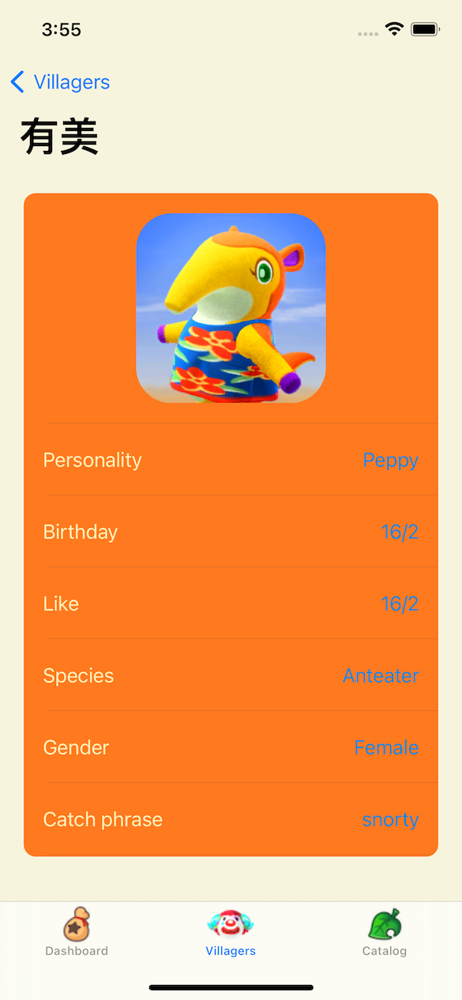

# ACNHDemo for iOS

This is an iOS APP Demo which build with Swift 5 and Xcode 12.4.

The App allow user browse gaming strategy of "Animal Crossing: New Horizon".

# Screenshot

Check villager's detail info

Check catalog's info, price, available time.

# Features
Provide information of:
- Dashboard
    - Available catalog
        - fishes
        - bugs
        - sea creatures
    - Today's Birthdays
    - Today's tasks
- Villagers
- Catalog
    - Songs
    - Fishes
    - Sea Creatures
    - Bugs
    - Fossils
    - Art
    - Hourly music (BGM)
    - Houseware
    - Wallmounted

And so on. (More features are in development)

# Development progress
## Stage 1 (Finish)
Functions to browse villagers, catalog.

## Stage 2
Dashboard's function.

# Technical Specifications
- Language: Swift 5
- IDE: Xcode 12.4
- Package Management: CocoaPods
- iOS version target: iOS 11.0

# Package Used
- Moya 14.0 with Alamofire
- DynamicColor 5.0.0